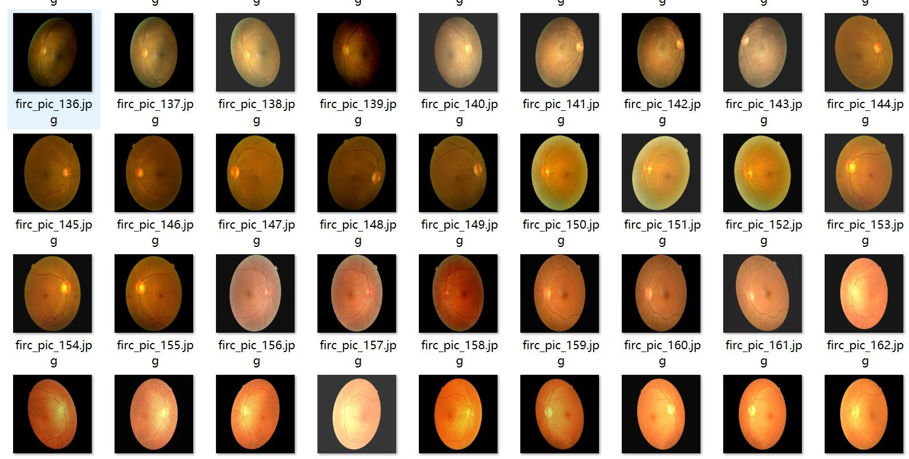
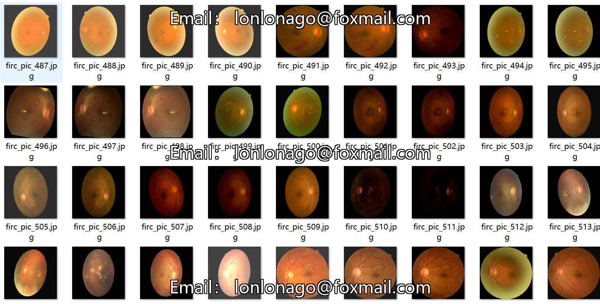
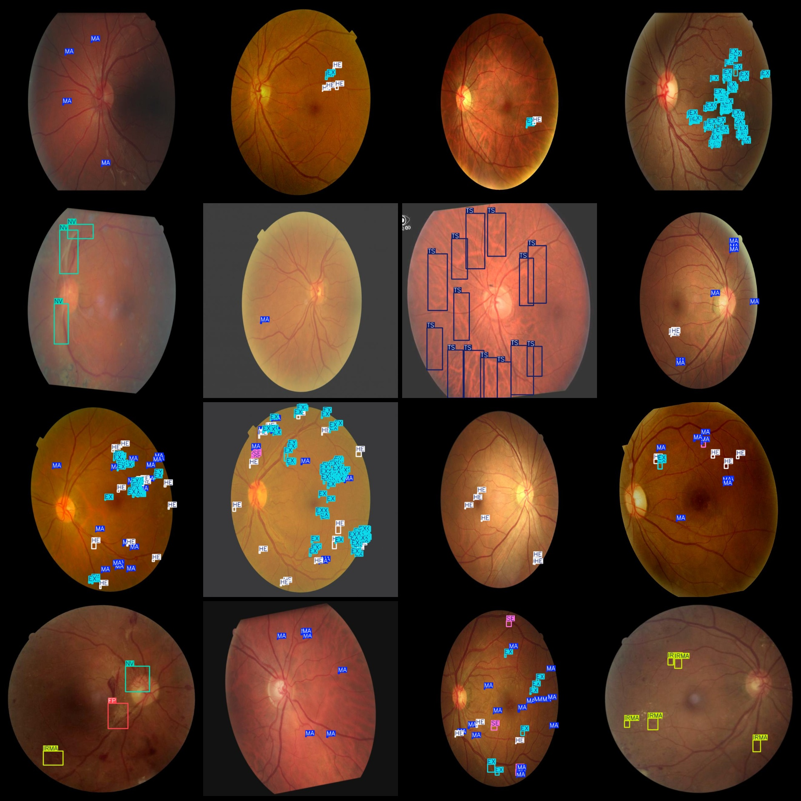
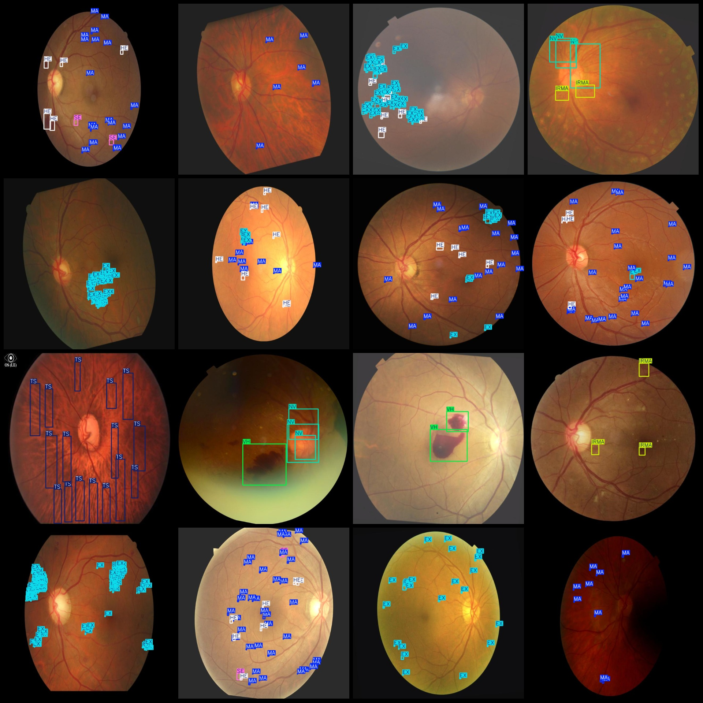

# Vision Dataset for Retinal Disease Detection in Ophthalmology - VOC+YOLO format with 2183 images and 9 classes enhanced

Please note that the dataset contains enhanced images.

Dataset format: Pascal VOC format + YOLO format (txt file without segmentation path, only contains jpg images and corresponding VOC format xml files and yolo format txt files)

Number of images (jpg file count): 2183

Number of XML files: 2183

The number of txt files is 2183.

Category count: 9

["EX", "FP", "HE", "IRMA", "MA", "NV", "SE", "TS", "VH"]

The number of boxes for each category:  
EX (hard exudate) = 99,009  
FP (fibrous proliferation) = 312  
HE (retinal hemorrhage) = 25,215  
IRMA (retinal intra-retinal microvascular abnormalities) = 630  
MA (microaneurysms) = 34,305  
NV (neovascularization) = 300  
SE (cotton-like patches) = 3587  
TS (lipid exudates) = 630  
VH (vitreous hemorrhage) = 363  
Total number of boxes: 164,351

The number of images per category:  
EX (Hard exudate) = 902  
FP (Fibrosis) = 102  
HE (Retinal hemorrhage) = 948  
IRMA (Retinal microvascular anomaly) = 198  
MA (Microaneurysm) = 1406  
NV (Neovascularization) = 126  
SE (Sebaceous streaks) = 372  
TS (Typical exudation) = 36  
VH (Vitreous hemorrhage) = 135

Image resolution: 640×640

Use the labeling tool: labelImg

Rule: Draw a rectangle around the category.
Important note: The dataset is not split into training, validation, and test sets; it needs to be split by yourself.
Special Notice: This dataset does not guarantee the accuracy of the trained model or weight files.
Image Resolution: 640x640
Labeling Tool: labelImg
Labeling Rules: Draw a rectangle around the category.
Important Note: The dataset does not have separate training, validation, and test sets; you must partition them yourself.
Special Disclaimer: This dataset does not guarantee the accuracy of the trained model or the weight file.
Preview of the image:
## Images

Here is a pay link on Stripe ( https://buy.stripe.com/3cs8yP7sY87d0vu9AB ). Please contact me lonlonago@foxmail.com after funding $89, and I will send you a complete data files , thank you!

